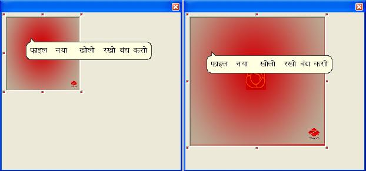



## With Mouse PictureBox Control

### Description

With MOUSE

This example shows How to

Grip, Move &amp; Stretch a PictureBox to fit the control.

&amp;

ToolTipText In hindi &amp; gujarati .....All
 
### More Info
 

             |
---                |---
**Submitted On**   |2002-02-02 04:39:14
**By**             |[chauhan j](https://github.com/Planet-Source-Code/PSCIndex/blob/master/ByAuthor/chauhan-j.md)
**Level**          |Advanced
**User Rating**    |5.0 (20 globes from 4 users)
**Compatibility**  |VB 4\.0 \(16\-bit\), VB 4\.0 \(32\-bit\), VB 5\.0, VB 6\.0
**Category**       |[Custom Controls/ Forms/  Menus](https://github.com/Planet-Source-Code/PSCIndex/blob/master/ByCategory/custom-controls-forms-menus__1-4.md)
**World**          |[Visual Basic](https://github.com/Planet-Source-Code/PSCIndex/blob/master/ByWorld/visual-basic.md)
**Archive File**   |[With\_Mouse2147363212009\.zip](https://github.com/Planet-Source-Code/chauhan-j-with-mouse-picturebox-control__1-71888/archive/master.zip)

